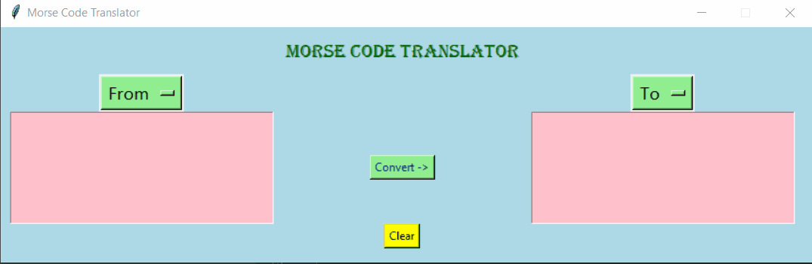

# Morse-Code-Translator
A simple GUI approach of Morse Code translator using Tkinter module of Python and some library based functions and data structures. 

# Demo

Open to any suggestions and additions.
